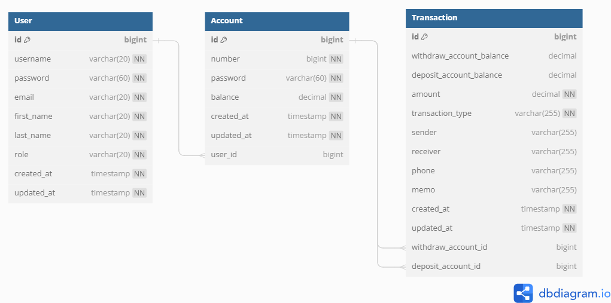

# 🏦 Bank Application 

# Project Description
The Bank Application is a simple yet comprehensive banking system designed to facilitate user interactions with their accounts securely. Users can perform various operations including registration, login, account management, transactions, and transaction history viewing. This project aims to provide a seamless banking experience for users while maintaining the security and integrity of their financial data.

# Backend Project
This is a backend project that develops server-side functionality to support the booking system. This includes database management, API development, authentication, and business logic implementation.

# Testing
The project employs JUnit 5 for testing purposes. Unit tests are implemented to ensure the correctness and reliability of backend functionalities. Testing covers various scenarios including positive and negative cases, boundary conditions, and error handling.

# ERD

# Features 
## 🦱 Member Management

# Tech Stack
### Programming Languages
 

### Frameworks
 
  
### Persistence

### Databases
 

### Testing

### Development Tools
 

### Version Control  

### Tools & Utilities
  

